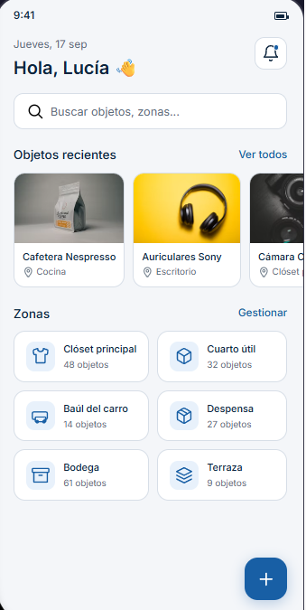
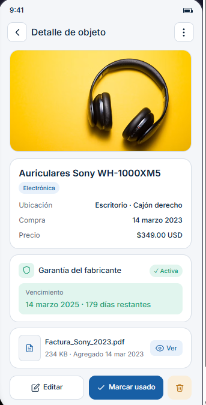
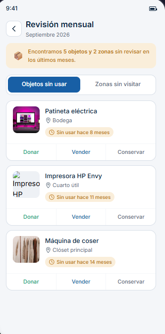
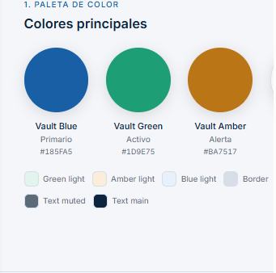
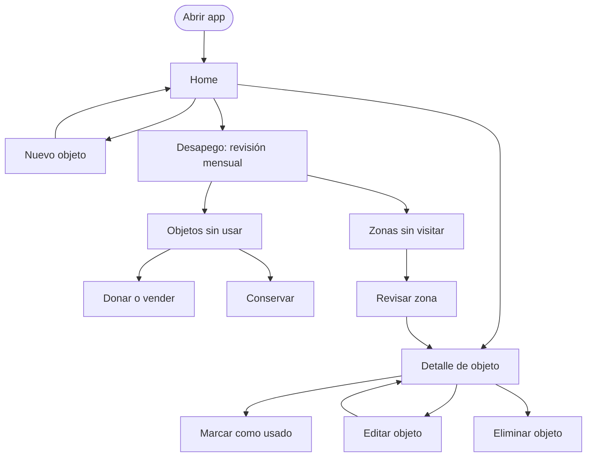

# MyVault

## Objetivo general
Desarrollar una aplicación móvil que permita a los usuarios registrar sus objetos personales indicando su ubicación física de almacenamiento (clósets, cajones, cuartos útiles, etc.), así como la información de compra, factura y garantía asociada, y que además sugiera de forma inteligente qué objetos y zonas de almacenamiento llevan mucho tiempo sin usarse, para apoyar decisiones de desapego (donar, vender o descartar).

## Problema que resuelve
Las personas acumulan objetos en distintos espacios de la casa (no solo "bodegas" formales) y con el tiempo pierden el rastro de qué tienen, dónde lo guardaron, si conservan la factura y si sigue en garantía. Además, rara vez se dan cuenta de cuánto tiempo llevan sin usar ciertos objetos o sin siquiera entrar a ciertas zonas de almacenamiento, lo que lleva a acumulación innecesaria.

## Alcance funcional

### Módulo 1 — Registro de objetos
- Crear/editar/eliminar objetos con foto, nombre, categoría y ubicación física
- Asociar cada objeto a una "zona" de almacenamiento (clóset, cajón, cuarto útil, baúl, etc.)
- Búsqueda y filtros por ubicación, categoría o estado

### Módulo 2 — Garantías y facturas
- Adjuntar foto de la factura a cada objeto
- Registrar fecha de compra y vencimiento de garantía
- Notificaciones locales cuando una garantía está por vencer

### Módulo 3 — Sugerencias de desapego (reto principal del proyecto)
- Timestamp de última interacción por **objeto** (registro, búsqueda, marcado como usado)
- Timestamp de última visita por **zona** (última vez que se abrió/consultó esa zona)
- Score combinado de inactividad: tiempo sin tocar el objeto + tiempo sin visitar su zona + categoría del objeto (la ropa de temporada no pesa igual que un electrodoméstico)
- Reporte periódico (ej. mensual) con dos vistas:
  - "Objetos que no usas" — candidatos individuales a donar/vender
  - "Zonas que no visitas" — áreas completas de baja actividad, útiles cuando hay poca data por objeto pero la zona entera lleva tiempo sin revisarse

## Pantalla home:

 
 

## Pantalla 1:

 
 

## Pantalla 2:

 

 
## Paleta de colores:

 

## Flujo de la app:

